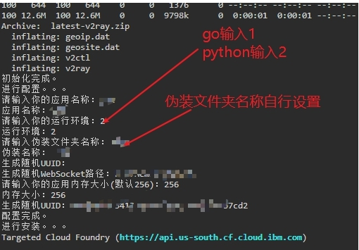

# IBMYesPlus

#### 更新说明

整理IBMYes代码，并做适当更新，主要改动如下：

1. 跳过IBM代码审核（修改v2ray名称以跳过代码审核，不知道能稳定多久，能快乐一天是一天）
2. 容器环境请随意选择，不要对着go疯狂的撸，已测试大部分环境均适用（亲测Python支持除了tomcat之外所有环境，go测试了javapython go swift适用，其他没测试）
3. 验证是否成功方式：域名/随机生成的websocker路径   显示Bad Requests就表示正常使用
4. v2配置做了修改，增加websocker路径，vmsess链接里无需删除随机路径

#### 使用说明

1. 自己开容器，环境自己选（看更新说明适用环境），安装时会让选择环境参数，1代表go代码，2代表python代码

2. 另一个需要设置参数是v2ray伪装名称，自行设置（尽可能选择英文字母）

3. 其他使用教程照搬IBMYes即可，直达链接：https://github.com/CCChieh/IBMYes

4. 能否使用一切随缘，只增加重命名代码，有问题不要发issue，发了我也解决不了，建议去参考原作者issue

5. 本代码仅自用，顺带方便一下mjj

    

如图：

#### 一键伪装代码

~~~~
wget --no-check-certificate -O install.sh https://raw.githubusercontent.com/w2r/IBMAllYes/master/install.sh && chmod +x install.sh  && ./install.sh
~~~~

#### CCChie代码手动伪装

因为IBM加入代码审核，需要把v2ray伪装其他名字避过审核，下面提供手动修改教程教程

~~~
# 大佬一键安装代码
wget --no-check-certificate -O install.sh https://raw.githubusercontent.com/CCChieh/IBMYes/master/install.sh && chmod +x install.sh  && ./install.sh
安装后会报错，不用理会

# 以下操作均在IBMcloud控制台操作
# 回到主目录
cd
cd IBMYes/v2ray-cloudfoundry/
# 重命v2ray文件夹，请自行修改名字
mv v2ray/  hostloc
# 重命名v2ray
cd hostloc/
mv v2ray  mjj
# 返回上一层
cd ..
# 修改Procfile文件，默认自动启动v2ray
vi Procfile
# 修改内容web: ./v2ray/v2ray换成你伪装的名字（不要和我一样）
# 输入i编辑，按esc然后输入:wq保存
web: ./hostloc/mjj

# 重新push
ibmcloud cf push 你应用名称
# 测试是否成功
打开域名，Bad Request，使用vmess链接要记得掉伪装路径
~~~

